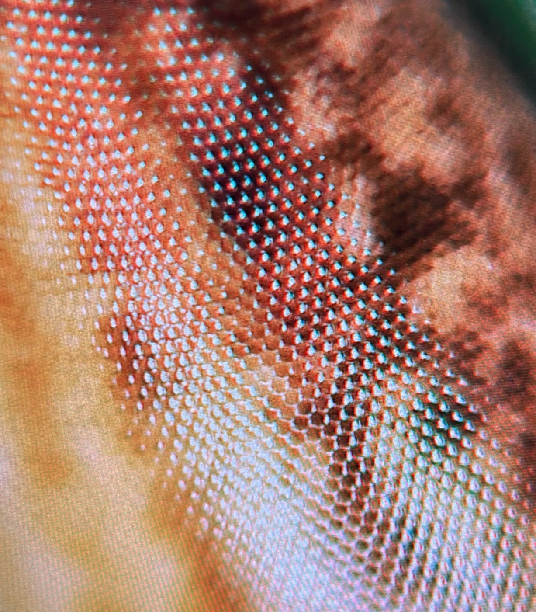
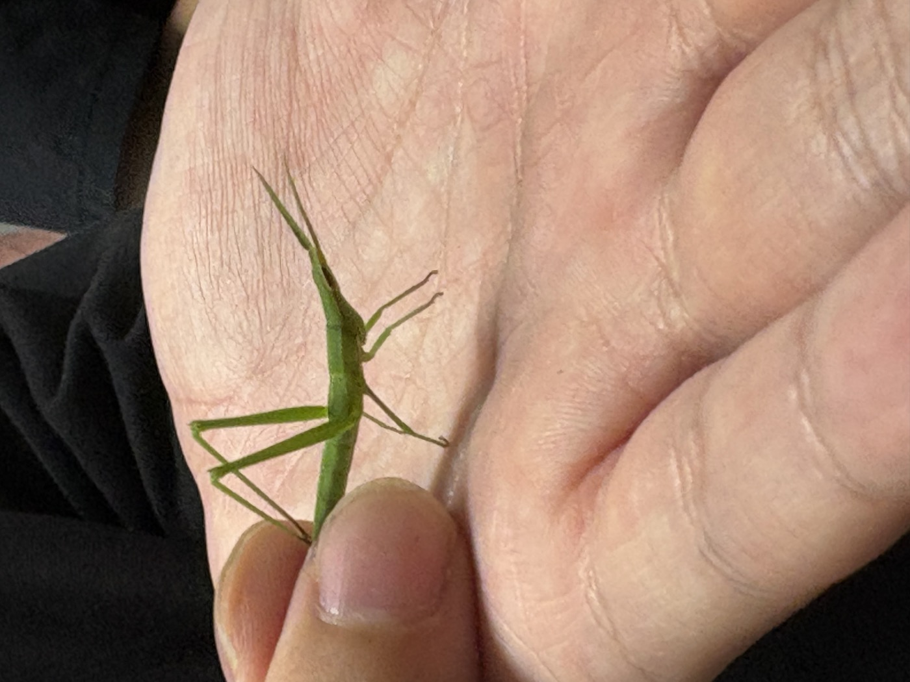

# ミクロGP — 顕微クイズ進行卓

**ミクロGP (Micro Grand Prix)** は、電子顕微鏡や超接写で撮った「謎のミクロ写真」を大画面に映し、それが身の回りの何なのかをチームで当てる、教室向けのクイズ進行アプリです。単一の HTML ファイルだけで動き、ネットワークもインストールも不要です。

九州大学「生物模倣工学」の授業で、学生が自分で標本を電子顕微鏡・デジタルマイクロスコープで撮影し、その場で出題し合うために作りました。

<p align="center">
  
</p>

<p align="center">
  
  
</p>
<p align="center"><em>左：謎のミクロ写真（規則正しく並ぶ粒は…？）　→　右：種明かし（ショウリョウバッタの複眼）</em></p>

---

## 使い方

### 起動

`index.html` をブラウザで開くだけです。

- **ファイルを選ぶ**だけなら `index.html` をダブルクリックで開けます。
- **フォルダごと読み込む**（チーム別に一括投入）を使うときは、ローカルサーバー経由で開くと確実です。

```bash
# このフォルダで
python3 -m http.server 8000
# ブラウザで http://localhost:8000/ を開く
```

スコアはブラウザの localStorage に自動保存されるので、途中でリロードしても消えません。

### 遊び方（進行の流れ）

1. **セットアップ画面**でチーム数（2〜8）とチーム名を決める。
2. **画像を読み込む**。各問は「謎のミクロ写真」＋「種明かし写真」の2枚がペア（種明かしは無くても可）。
3. **開始** を押すと進行画面へ。
4. 出題チームの謎写真を大画面に表示し、タイマー（目安30秒）の間に各チームが「何のどこか」を答える。
5. まず **①ヒントなし** で判定。誰もドンピシャが出なければ **②ヒントあり** に進み、もう一度答える。
6. **種明かし** ボタンで正解の普通写真を公開。
7. **次の問題 ▸** で進み、全問終わると **順位** 発表。

### 得点ルール

判定は3種類：**ドンピシャ**（ぴったり）／**一部**（惜しい）／**ハズレ**。

| ステージ | ドンピシャ | 一部 | ハズレ |
|---|---|---|---|
| ① ヒントなし | +10 | +5 | 0 |
| ② ヒントあり | +5 | +1 | 0 |

早い段階で当てるほど高得点です。

### 出題ボーナス

良問を作った出題チームに入るボーナスです。

- **出題ボーナス ＝（その問題でドンピシャできなかった解答チームの数）× 3点**
- 全チームが簡単に当ててしまうと 0 点。程よく難しい問題ほど高得点。
- 「納得（出題ボーナス有効）」がオンの問題だけ計上されます（答えが妥当だと皆が納得した良問のみ）。

---

## 画像ファイルの命名規約

ファイル名やフォルダ名に手がかりを入れておくと、自動でチーム・問番号・役割を判定します（何も無くても、読み込み順に1問ずつ割り当てて動きます）。

| 手がかり | 意味 | 例 |
|---|---|---|
| `micro` / `macro` / `謎` / `nazo` | 謎写真（出題として表示） | `t1_q1_micro.jpg` |
| `reveal` / `answer` / `答え` | 種明かし写真 | `t1_q1_reveal.jpg` |
| `t1`〜`t8` | 出題チーム番号 | `t3_...` |
| `q1`, `q2`… | 問の順番 | `..._q2_...` |
| `tg7` / `om1` / `fabre` / `hirox` / `sem` | 撮影機材（画面に倍率ラベルとして表示・任意） | `..._sem.jpg` |

`t#_q#` が一致する謎写真と種明かし写真がペアになります。役割語が無い場合は「1枚目＝謎／2枚目＝種明かし」として扱います。チーム番号は、画像を入れたフォルダ名（`チーム1`, `班3`, `1` など）からも読み取ります。

---

## サンプルデータ

`samples/` に、実際の授業で学生が撮影した6チーム分のミクロ／種明かしペアが入っています（コケ、硬貨、革、バッタ、小さな虫など）。`samples/` フォルダをそのまま「フォルダで読み込む」で投入すれば、すぐに1ゲーム分を試せます。

---

## 技術メモ

- **単一 HTML ファイル**（`index.html`）で完結。外部依存・ネットワーク通信なし。
- 画像はブラウザ内で `URL.createObjectURL` により表示（アップロードされない）。
- スコア・判定は `localStorage` に自動保存。
- ホスト1台での進行を想定した「進行卓」型 UI（学生は大画面を見て解答するだけ）。

## ライセンス

MIT License. 授業・イベントで自由に使ってください。

サンプル画像は九州大学「生物模倣工学」受講生が撮影したものです。
